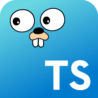

# Go2dts



A simple cli-tools to transform golang `struct` and `const` to typescript `interface` and `type`

### Installation

```bash
npm i -g go2dts
```

### Usage

```bash
go2dts <goLangDirs ...> <typescriptFile>
```

### Testing and developing

Just put your golang file into `__tests__/inputs` and it will be parse each time you execute `npm test` or `npm start`.

`npm start` is more quick, so perfect to add some console.log and improve the parsing.

`npm test --watch` generate a snapshot, so you can just update this one to the expecting state and start coding to have everything green #TDDStyle

### Know issues

- The type mapping is incomplete (I'm not a golang developper, so I add types when I discover them)
- This library will not follow the `import` dependencies, so the output types can be broken
